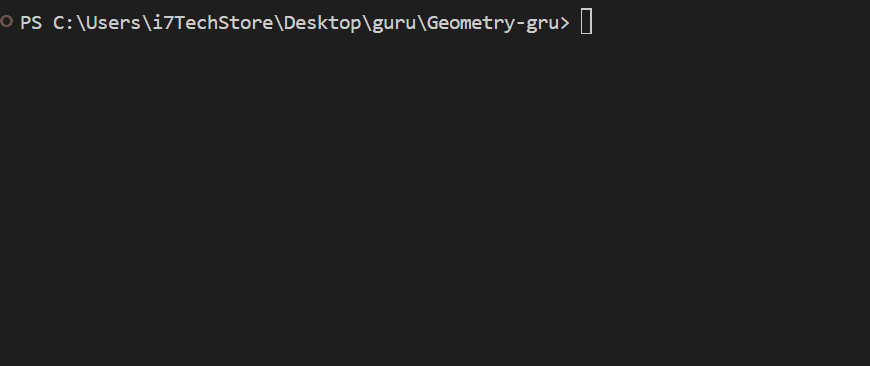

#  Geometry Guru 🧮

>> Geometriyaga oid asosiy shakllar yuzasini hisoblaydigan C# dasturi.

>✨ Dastur nimalar qila oladi?

*Ushbu konsol ilovasi foydalanuvchiga quyidagilarni hisoblash imkonini beradi*:

№	Funksiya	Tavsifi
1	Uchburchak yuzasi	Asos va balandlik orqali yuzani topadi
2	To'rtburchak yuzasi	Uzunlik va kenglikdan foydalanib yuzani hisoblaydi
3	Doira yuzasi	Radius kiritilganda yuzani hisoblaydi
4	Ikki tomondan uchinchi tomon oralig'ini topish	Uchburchakning uchinchi tomoni imkoniyatlar oraliğini chiqaradi
5	Chiqish	Dasturdan chiqadi
🛠 Texnologiya
copy:c:\Users\i7TechStore\Desktop\guru\Geometry-gru\Gif.gif

C#

 

>>.NET Console Application

>📌 Ishga tushirish

* Kodni .cs faylga joylang (Program.cs)

VS, VS Code yoki Rider orqali ishga tushiring.

Konsolda menyudan kerakli bo‘limni tanlang *.

🔍 Misol ko‘rinishi
=== Geometry Guru ===
1. Uchburchak yuzasi
2. To'rtburchak yuzasi
3. Doira yuzasi
4. Ikki tomon bo'yicha uchinchi tomon oraliği
5. Chiqish
Tanlang: 1

Asos = 10
Balandlik = 6
Uchburchak yuzasi = 30

Yana davom ettirasizmi? (ha/yoq): ha

>>📎 Yo'l xaritasi (Kengaytirish uchun g‘oyalar)

>Kelajakda quyidagilar qo‘shilishi mumkin:

* Perimetr hisoblash

* Uchburchak turlari aniqlash

* 3D shakllar (kub, shar, prizma)

* Grafik ko‘rinishda shakl chiqazish (console art)
